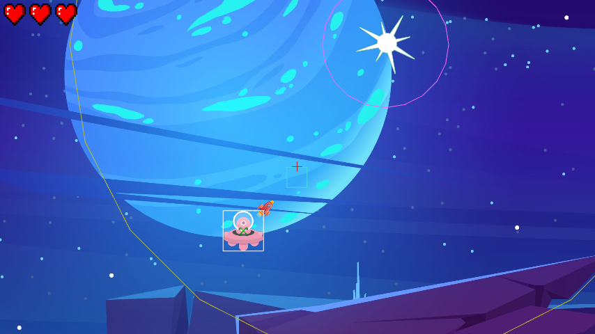

## Previously on Another Project

Recently I [created a Web-Port](https://blog.lusito.info/the-last-summoner-an-exploration-game.html) of an old game from 2016 and I talked about a camera library I was working on.
The day has come for this library to see its first release.

## What This Library Is About

The main attraction of the library is an influenced camera inspired by the [camera from Insanely Twisted Shadow Planet](http://michelgagne.blogspot.com/2012/07/itsp-camera-explained.html).

The main idea of that camera is, that you can let it be influenced by relative offsets (for example the player aiming at something or moving in a direction) and cues in the world (something the player should pay attention to). Check out the video in the blog linked above to get a detailed explanation.

## Watch It In Action or Try It Yourself

[Check out the demo video on LinkedIn](https://www.linkedin.com/posts/santo-pfingsten_gamedevelopment-2dcamera-ugcPost-6896029825153187840-HLBS?utm_source=linkedin_share&utm_medium=member_desktop_web) or give it a try: [online demo](https://lusito.github.io/pixlcam/example/), not made for mobile.

## Verdict

It's surprisingly hard to make a smooth transition between multiple influences, but after a lot of headache and trial & error, I got it working. There's still some work left to do, but I'm quite happy with the current state.

Feel free to leave some feedback.
