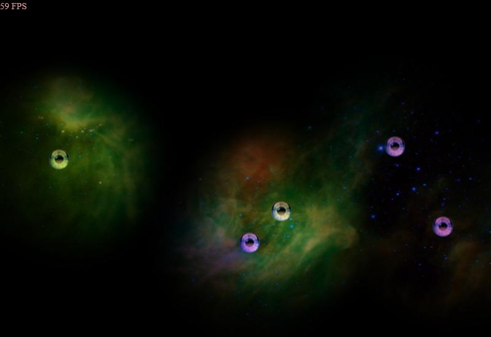

## Playing Around With WebGL

Try pushing some marbles around in your browser: [Demo](https://lusito.github.io/box2d.ts/testbed/#/Lights#Official_Demo)

The above is the official demo just as LibGDX showcases it. It really doesn't show the full potential. Check out youtube to see what people can do with it:

- https://www.youtube.com/watch?v=rkJph0hQGys
- https://www.youtube.com/watch?v=K4Gr1sXnl9A
- https://www.youtube.com/watch?v=OVqR9vmcseo

We've used the original (in Java) on a lot of student projects: https://github.com/libgdx/box2dlights

**Follow-Up:** It has officially been [released](https://blog.lusito.info/typescript-port-of-box2d-lights.html) as part of the [@box2d](https://lusito.github.io/box2d.ts/) Eco-System!
