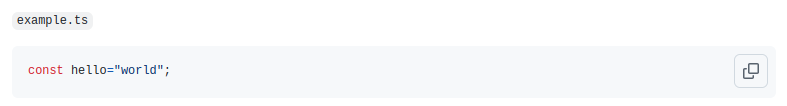

## What Is Progressive Enhancement?

Progressive Enhancement is when the core functionality of your website is always present, but advanced functionality is enabled if the browser supports it.

This can even be extended to your data-source in the case of my blog.

## A Real World Scenario

A bit of background: All of my blog entries are written in markdown.

Markdown supports embedding code-blocks in this form:

````md
```ts
const hello = "world";
```
````

When rendered to HTML, it looks like this:

```ts
const hello = "world";
```

This is rendered on the server, so visually this works fine. The only thing that I added on the client-side is a custom element (button) to copy the content of that code-block. That by definition is already progressive enhancement, but it's not what I want to talk about today.

Markdown does not support showing a title or filename for a code-block, which would be helpful when writing content for developers. Having multiple code blocks merged into a tab-component would also nice if you want to show the same step for different tooling (for example using npm/yarn/pnpm).

There have been requests to add this to GitHub and other projects and some have implemented their own flavor for doing this. Yet, I still have to find an approach that incorporates progressive enhancement.

## My Approach

With the goal of using progressive enhancement, let's start at the very core: markdown!

Other approaches either add html within the markdown file or add extra information to the code block. Both of these methods result in the markdown not showing the filename when viewed in a regular markdown renderer (for example Github), which does not support that syntax. Aside from that, reading the raw markdown is also not very pleasant. Markdown is supposed to be human readable without rendering it first!

So here's my idea on how it should look like in markdown:

````md
`example.ts`

```ts
const hello = "world";
```
````

This will be rendered by GitHub like this:



So, now we have something that is readable in markdown and is readable in a normal markdown renderer. However, this is not how I want it to be shown on my webpage.

## Server Side Enhancement

The next step is to make it look good in my blog. This can be done in parts on my server.
So I'll inspect the DOM of the rendered HTML and loop over all elements. In pseudo code, this looks something like this:

```ts
result.querySelectorAll("pre > code.hljs").forEach((el) => {
  if (previousElementIsInlineCode(el)) {
    wrapElementInCustomElement(el);
  }
});
```

This will prepare the dom in a way, so that it looks nice when some additional CSS is involved:

`example.ts`

```ts
const hello = "world";
```

Nice!

## Client Side Enhancements

This worked great:

- Markdown is readable.
- It's readable when passed through a renderer that doesn't support the special title syntax.
- It looks nice when special rendering is enabled.

You can check out the [raw markdown file](https://github.com/Lusito/blog/blob/main/src/blog/pages/misc/markdown-code-with-title.page.md?plain=1) for this blog post. Though I have to admit, that writing markdown within markdown code blocks isn't the nicest thing, this is not something you usually do.

### Adding Tabs

Now I want to be able to render tabs when one **named** code block is followed by another, like this:

````md
`npm`

```bash
npm i -D tsx-dom
```

`yarn`

```bash
yarn add -D tsx-dom
```

`pnpm`

```bash
pnpm add -D tsx-dom
```
````

When not doing any extra client side code, this renders this:

`npm`

```bash
npm i -D tsx-dom
```

<div></div>

`yarn`

```bash
yarn add -D tsx-dom
```

<div></div>

`pnpm`

```bash
pnpm add -D tsx-dom
```

However, I want it to look like this (if you disable JavaScript, this will look the same as the above):

`npm`

```bash
npm i -D tsx-dom
```

`yarn`

```bash
yarn add -D tsx-dom
```

`pnpm`

```bash
pnpm add -D tsx-dom
```

You can make tabs work without JavaScript (with the [CSS checkbox hack](https://css-tricks.com/the-checkbox-hack/) for example), but that is really messy and not good for accessibility.

My server side code already prepared the HTML using custom elements (`<code-block>`), so there are only two things to do on the client side:

1. Merge multiple (single) code blocks that follow each other.
2. Add aria attributes for accessibility reasons and hide all non-selected panels
3. Add click and keyboard listeners, which can update the attributes to change the selected tab.

The simplified code looks something like this:

`CodeBlock.ts`

```ts
class CodeBlock extends HTMLElement {
  private activated = false;

  connectedCallback() {
    if (this.activated) this.activate();
  }

  disconnectedCallback() {
    // remove event listeners
  }

  public activate() {
    // add listeners
  }
}

customElements.define("code-block", CodeBlock);

function mergeTabs() {
  for (const codeBlock of codeBlocks) {
    // check if preceded by another code-block element
    // If so, merge tab and panel of this block into it
    // and update aria-selected/hidden attributes.
  }

  // call activate() on all remaining code-block elements
}

mergeTabs();
```

## Pitfalls

Progressive enhancement can lead to [Cumulative Layout Shift](https://web.dev/articles/cls) if you change content.
This can cause a disruption in the user experience and also affect your search engine ranking.

So be careful not to modify content too drastically in the top part of your page.

In my above use-case, multiple blocks will be collapsed into a tab-view. This creates a vacuum and thus a big layout shift.
Depending on the size of the code this might be quite large.
However, in this case, it should be fine, since code-blocks are rarely very high up in the document and users will rarely see this.

## Conclusion

- Writing code using progressive enhancement is fun.
- Since there is very little code on the client side, it performs very well.
- It's great for mainly static pages, which should work even if some things break.
- It's not difficult to implement once you get the basic idea.
- Watch out for layout shifting!
- Keep accessibility in mind!
